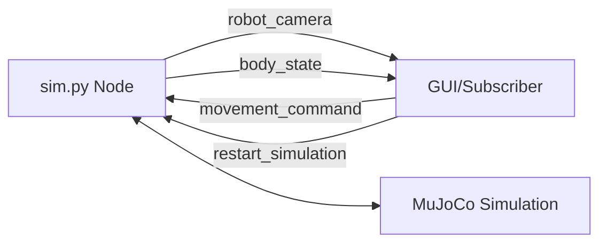

## Overview

The `sim.py` script bridges the MuJoCo simulation with ROS2, enabling:
- Real-time camera image streaming
- Body state (position/orientation) publishing
- Remote movement commands via topics
- Simulation restart service

This allows you to control the robot from external nodes, integrate with ROS2 tools, and build distributed robotics applications.

## Architecture



### ROS2 Topics

<CardGroup cols={2}>
  <Card title="Published Topics" icon="upload">
    **robot_camera** (`sensor_msgs/Image`)
    - Camera feed from robot's perspective
    - 640×480 RGB images at 10 Hz
    - Frame ID: `robot_camera`
    
    **body_state** (`std_msgs/Float32MultiArray`)
    - Robot pose: `[x, y, z, roll, pitch, yaw]`
    - Updated at 10 Hz
    - Position in meters, angles in radians
  </Card>
  
  <Card title="Subscribed Topics" icon="download">
    **movement_command** (`std_msgs/Int32`)
    - `0`: Stop (freeze gait)
    - `1`: Forward movement
    - `2`: Backward movement
    - Applied immediately to gait controller
  </Card>
</CardGroup>

### ROS2 Services

**restart_simulation** (`std_srvs/Trigger`)
- Resets MuJoCo simulation state
- Resets gait controller phase
- Returns success confirmation

## Two-Terminal Setup

You need two terminals: one for the simulation, one for the GUI controller.

<Steps>
  <Step title="Terminal 1: Launch Simulation">
    Start the ROS2-enabled simulation:
    
    <Tabs>
      <Tab title="Flat Terrain">
        ```bash
        cd ~/workspace/source
        python3 sim.py --terrain flat
        ```
        
        Output:
        ```
        Loading world: model/world.xml (flat terrain)
        [INFO] [robot_control_node]: Robot Control Node initialized
        ```
      </Tab>
      
      <Tab title="Rough Terrain">
        ```bash
        cd ~/workspace/source
        python3 sim.py --terrain rough
        ```
        
        Output:
        ```
        Loading world: model/world_train.xml (rough terrain)
        [INFO] [robot_control_node]: Robot Control Node initialized
        ```
      </Tab>
    </Tabs>
    
    The MuJoCo viewer opens and the robot starts in place (waiting for movement commands).
  </Step>

  <Step title="Terminal 2: Launch GUI Controller">
    In a new terminal, start the control GUI:
    ```bash
    cd ~/workspace/source
    python3 gui/gui.py
    ```
    
    The PyQt5 GUI window opens with:
    - Login screen (credentials in `gui/users.db`)
    - Camera feed view
    - Gamepad control interface
    - Body state visualization
  </Step>

  <Step title="Control the Robot">
    Use the gamepad D-pad or joystick:
    - **Up**: Robot moves forward
    - **Down**: Robot moves backward  
    - **Release**: Robot stops
    - **Button 0**: Restart simulation
  </Step>
</Steps>

## Topic Details

<Tabs>
  <Tab title="Camera Images">
    ### robot_camera Topic
    
    **Message Type**: `sensor_msgs/msg/Image`
    
    **Published by**: `sim.py` (RobotControlNode)
    
    **Frequency**: 10 Hz (every 0.1 seconds)
    
    **Specifications**:
    - Resolution: 640×480 pixels
    - Encoding: `rgb8` (24-bit color)
    - Frame ID: `robot_camera`
    - Source: MuJoCo offscreen renderer (`sim.py:233`)
    
    **Subscribing Example**:
    ```python
    import rclpy
    from rclpy.node import Node
    from sensor_msgs.msg import Image
    from cv_bridge import CvBridge
    
    class ImageSubscriber(Node):
        def __init__(self):
            super().__init__('image_subscriber')
            self.bridge = CvBridge()
            self.subscription = self.create_subscription(
                Image,
                'robot_camera',
                self.image_callback,
                10
            )
        
        def image_callback(self, msg):
            cv_image = self.bridge.imgmsg_to_cv2(msg, 'rgb8')
            # Process image...
    ```
  </Tab>
  
  <Tab title="Body State">
    ### body_state Topic
    
    **Message Type**: `std_msgs/msg/Float32MultiArray`
    
    **Published by**: `sim.py` (RobotControlNode)
    
    **Frequency**: 10 Hz
    
    **Data Format**: `[x, y, z, roll, pitch, yaw]`
    - `x, y, z`: Position in meters (world frame)
    - `roll, pitch, yaw`: Orientation in radians (Euler XYZ)
    
    **Source**: MuJoCo body sensors (`sim.py:279-285`)
    
    **Subscribing Example**:
    ```python
    from std_msgs.msg import Float32MultiArray
    
    class StateSubscriber(Node):
        def __init__(self):
            super().__init__('state_subscriber')
            self.subscription = self.create_subscription(
                Float32MultiArray,
                'body_state',
                self.state_callback,
                10
            )
        
        def state_callback(self, msg):
            x, y, z, roll, pitch, yaw = msg.data
            print(f"Position: ({x:.3f}, {y:.3f}, {z:.3f})")
            print(f"Orientation: ({roll:.3f}, {pitch:.3f}, {yaw:.3f})")
    ```
  </Tab>
  
  <Tab title="Movement Commands">
    ### movement_command Topic
    
    **Message Type**: `std_msgs/msg/Int32`
    
    **Subscribed by**: `sim.py` (RobotControlNode)
    
    **Command Values**:
    - `0`: Stop (freeze gait, hold current position)
    - `1`: Move forward (normal gait progression)
    - `2`: Move backward (inverted gait direction)
    
    **Implementation**: See `sim.py:159-199`
    
    **Publishing Example**:
    ```python
    from std_msgs.msg import Int32
    
    class MovementPublisher(Node):
        def __init__(self):
            super().__init__('movement_publisher')
            self.publisher = self.create_publisher(
                Int32,
                'movement_command',
                10
            )
        
        def move_forward(self):
            msg = Int32()
            msg.data = 1
            self.publisher.publish(msg)
        
        def stop(self):
            msg = Int32()
            msg.data = 0
            self.publisher.publish(msg)
    ```
  </Tab>
</Tabs>

## Services

### restart_simulation Service

**Service Type**: `std_srvs/srv/Trigger`

**Server**: `sim.py` (RobotControlNode)

**Behavior** (`sim.py:90-96`):
1. Resets MuJoCo data (`mj_resetData`)
2. Resets gait controller phase
3. Resets camera capture timer
4. Returns success response

**Calling Example**:

<CodeGroup>
  ```python Python Client
  from std_srvs.srv import Trigger
  
  class RestartClient(Node):
      def __init__(self):
          super().__init__('restart_client')
          self.client = self.create_client(
              Trigger,
              'restart_simulation'
          )
      
      def call_restart(self):
          request = Trigger.Request()
          future = self.client.call_async(request)
          future.add_done_callback(self.response_callback)
      
      def response_callback(self, future):
          response = future.result()
          if response.success:
              print(f"Restart successful: {response.message}")
  ```
  
  ```bash Command Line
  # Call from terminal
  ros2 service call /restart_simulation std_srvs/srv/Trigger
  ```
</CodeGroup>

## Debugging

<AccordionGroup>
  <Accordion title="Check Active Topics">
    List all active ROS2 topics:
    ```bash
    ros2 topic list
    ```
    
    Expected output:
    ```
    /body_state
    /movement_command
    /parameter_events
    /robot_camera
    /rosout
    ```
  </Accordion>
  
  <Accordion title="Monitor Topic Data">
    Echo messages from a topic:
    ```bash
    # View body state updates
    ros2 topic echo /body_state
    
    # View movement commands
    ros2 topic echo /movement_command
    
    # Check camera publishing rate
    ros2 topic hz /robot_camera
    ```
    
    Expected camera rate: ~10 Hz
  </Accordion>
  
  <Accordion title="Inspect Topic Info">
    Get detailed topic information:
    ```bash
    ros2 topic info /robot_camera
    ```
    
    Output:
    ```
    Type: sensor_msgs/msg/Image
    Publisher count: 1
    Subscription count: 1
    ```
  </Accordion>
  
  <Accordion title="Test Services">
    List available services:
    ```bash
    ros2 service list
    ```
    
    Call restart service manually:
    ```bash
    ros2 service call /restart_simulation std_srvs/srv/Trigger
    ```
    
    Expected response:
    ```
    success: True
    message: 'Simulation restart requested'
    ```
  </Accordion>
  
  <Accordion title="Check Node Status">
    List running nodes:
    ```bash
    ros2 node list
    ```
    
    Expected nodes:
    ```
    /gui_ros_node
    /robot_control_node
    ```
    
    View node info:
    ```bash
    ros2 node info /robot_control_node
    ```
  </Accordion>
</AccordionGroup>

## Common Issues

<AccordionGroup>
  <Accordion title="No Camera Images Received">
    **Symptoms**: GUI shows no camera feed
    
    **Checks**:
    1. Verify topic is publishing:
       ```bash
       ros2 topic hz /robot_camera
       ```
    2. Check for errors in `sim.py` terminal
    3. Ensure cv_bridge is installed:
       ```bash
       pip install opencv-python
       sudo apt install ros-humble-cv-bridge
       ```
  </Accordion>
  
  <Accordion title="Movement Commands Not Working">
    **Symptoms**: Robot doesn't respond to gamepad
    
    **Checks**:
    1. Verify commands are being published:
       ```bash
       ros2 topic echo /movement_command
       ```
    2. Check gamepad detection in GUI terminal:
       ```
       Joystick detected: <gamepad_name>
       Button 0 pressed
       ```
    3. Ensure pygame is installed:
       ```bash
       pip install pygame
       ```
  </Accordion>
  
  <Accordion title="Simulation Crashes on Restart">
    **Symptoms**: `sim.py` exits when calling restart service
    
    **Solution**: This is a known issue with viewer restarts. Current implementation handles in-place data reset (`sim.py:248-258`) without recreating the viewer.
    
    If crashes persist, restart both terminals manually.
  </Accordion>
</AccordionGroup>

## Advanced Usage

### Custom ROS2 Node

Create your own control node:

```python custom_controller.py
import rclpy
from rclpy.node import Node
from std_msgs.msg import Int32, Float32MultiArray

class CustomController(Node):
    def __init__(self):
        super().__init__('custom_controller')
        
        # Subscribe to robot state
        self.state_sub = self.create_subscription(
            Float32MultiArray,
            'body_state',
            self.state_callback,
            10
        )
        
        # Publish movement commands
        self.cmd_pub = self.create_publisher(
            Int32,
            'movement_command',
            10
        )
        
        # Simple forward controller
        self.timer = self.create_timer(1.0, self.control_loop)
    
    def state_callback(self, msg):
        x, y, z, roll, pitch, yaw = msg.data
        self.get_logger().info(f'Robot at: ({x:.2f}, {y:.2f}, {z:.2f})')
    
    def control_loop(self):
        # Send forward command
        msg = Int32()
        msg.data = 1
        self.cmd_pub.publish(msg)

def main():
    rclpy.init()
    node = CustomController()
    rclpy.spin(node)
    node.destroy_node()
    rclpy.shutdown()

if __name__ == '__main__':
    main()
```

Run alongside `sim.py`:
```bash
python3 custom_controller.py
```

## Next Steps

<CardGroup cols={2}>
  <Card title="GUI Control" icon="gamepad" href="./gui-joystick">
    Learn about the PyQt5 GUI and gamepad integration
  </Card>
  <Card title="Baseline Testing" icon="flask" href="./baseline-vs-adaptive">
    Compare different control strategies
  </Card>
</CardGroup>