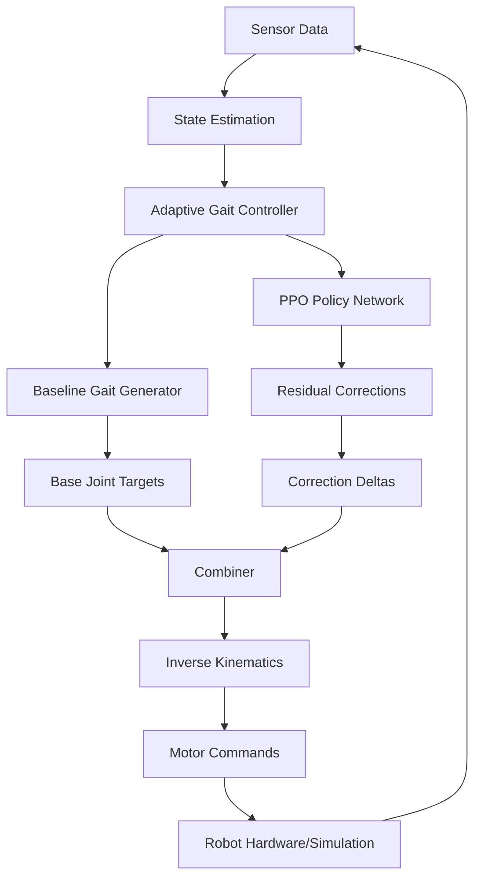

## Welcome to the Quadruped Robot Project

This project implements a **12-DOF quadruped robot** with adaptive control capabilities powered by reinforcement learning. The robot features a custom mechanical design and advanced control algorithms that enable it to navigate challenging terrain through learned adaptations.

## What Makes This Special?

This quadruped robot combines classical robotics with modern machine learning to achieve robust locomotion:

<CardGroup cols={2}>
  <Card title="Custom 12-DOF Design" icon="robot">
    Each leg features a 3-DOF parallel SCARA mechanism (5-bar linkage) with inverse kinematics for precise position control.
  </Card>
  <Card title="RL-Based Adaptation" icon="brain">
    PPO-trained policies add residual corrections to baseline gaits, improving performance by up to 967% on rough terrain.
  </Card>
  <Card title="MuJoCo Simulation" icon="cube">
    High-fidelity physics simulation with realistic contact dynamics and multiple terrain types.
  </Card>
  <Card title="ROS2 Integration" icon="diagram-project">
    Full ROS2 Jazzy support with topics, services, and a PyQt5 GUI for joystick control.
  </Card>
</CardGroup>

## Key Features

### Mechanical Design

- **12 Degrees of Freedom**: 3 actuated joints per leg
- **Parallel SCARA Legs**: 5-bar linkage mechanism with optimized kinematics
- **Custom CAD Model**: Designed in OpenSCAD, manufacturable for real hardware
- **Compact Workspace**: L1=0.045m, L2=0.06m, base_dist=0.021m

### Control Architecture

**Baseline Gait Controller**
- Diagonal gait pattern (trot) with paired opposite legs
- Bézier curve trajectories for smooth swing phase
- Linear stance phase for stable propulsion
- Configurable parameters: step length (0.04m), step height (0.02m), cycle time (1.2s)

**Adaptive RL Controller**
- Residual learning approach: RL policy adds corrections to baseline
- Trained with Stable Baselines 3 (PPO algorithm)
- Learns to compensate for terrain irregularities
- Adapts gait parameters online based on sensor feedback

### Simulation Environment

**MuJoCo Physics Engine**
- Realistic contact dynamics and friction modeling
- Hardware-accelerated rendering with real-time visualization
- Two terrain types: flat ground and irregular heightfield

**Multiple Terrains**
- `world.xml`: Flat terrain for baseline testing
- `world_train.xml`: Irregular heightfield with random elevations for RL training/evaluation

## Performance Comparison

The main demonstration compares three scenarios over 17 seconds:

<Steps>
  <Step title="Baseline on Flat Terrain">
    Pure kinematic gait controller on flat ground. Establishes baseline performance (~0.506m traveled).
  </Step>
  <Step title="Baseline on Rough Terrain">
    Same controller on irregular terrain. Performance degrades by ~41% due to lack of adaptation (~0.299m traveled).
  </Step>
  <Step title="Adaptive RL on Rough Terrain">
    RL-enhanced controller on same rough terrain. Recovers performance with 967% improvement over baseline rough (~3.191m traveled).
  </Step>
</Steps>

<Note>
  The adaptive controller doesn't just match flat-terrain performance—it often exceeds it by learning more efficient gaits for the specific terrain.
</Note>

## Architecture Overview

## Technical Specifications

| Component | Details |
|-----------|--------|
| **Total DOF** | 12 (3 per leg) |
| **Leg Kinematics** | Parallel SCARA 5-bar linkage |
| **Body Height** | 0.08m (nominal) |
| **Step Length** | 0.04m (baseline) |
| **Step Height** | 0.02m (baseline) |
| **Cycle Time** | 1.2s (baseline) |
| **Simulation Timestep** | 2ms (500Hz) |
| **RL Algorithm** | PPO (Proximal Policy Optimization) |
| **Training Framework** | Stable Baselines 3 + PyTorch |

## Coordinate Frames

<Warning>
  Pay attention to coordinate frame conventions when working with the code:
  - **IK Frame**: Z-axis points downward (gravity direction)
  - **Gait Controller**: +X is forward, inverted via `FORWARD_SIGN = -1.0` to match IK frame
  - **MuJoCo World**: Standard right-handed coordinate system
</Warning>

## Use Cases

### Research Applications
- Study residual learning for legged locomotion
- Benchmark RL algorithms on quadruped control
- Investigate terrain adaptation strategies
- Test sim-to-real transfer techniques

### Educational Applications
- Learn inverse kinematics for parallel mechanisms
- Understand gait generation and trajectory planning
- Explore reinforcement learning for robotics
- Practice ROS2 integration and system architecture

### Development Applications
- Prototype quadruped robot control algorithms
- Validate mechanical designs in simulation
- Test sensor fusion and state estimation
- Develop teleoperation interfaces

## What's Next?

Ready to get started? Follow our guides:

<CardGroup cols={2}>
  <Card title="Installation" icon="download" href="/installation">
    Set up your development environment with ROS2 Jazzy and Python dependencies.
  </Card>
  <Card title="Quick Start" icon="rocket" href="/quickstart">
    Run your first simulation and see the baseline vs adaptive comparison in ~10 minutes.
  </Card>
</CardGroup>

## Demo Video

Watch the robot in action navigating rough terrain:

[View Demo Video](https://drive.google.com/file/d/1ZFX_Mz6WEISDz5IWsRfotk7-QPtXtzc1/view)

## Open Source

This project is built with transparency and collaboration in mind. All code is available for academic and research purposes, including:
- Complete robot CAD files (OpenSCAD)
- Control algorithms (baseline and adaptive)
- RL training scripts and environments
- Pre-trained models and evaluation tools

<Note>
  The robot design has not been tested on physical hardware, but the CAD model is designed to be manufacturable.
</Note>